# CS_comics

## The Never Ending Cycle of Enterprise IT
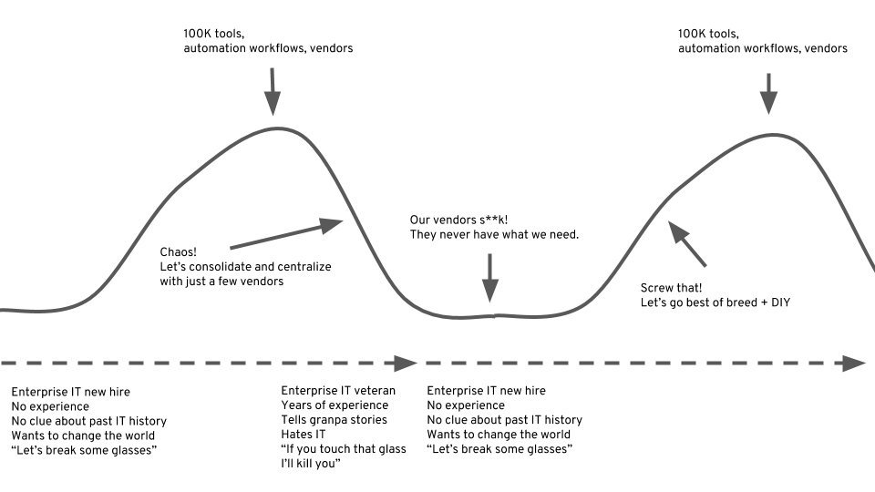

source [tweet](https://twitter.com/giano/status/1007563057617362944)

## Microservices - Conway's law
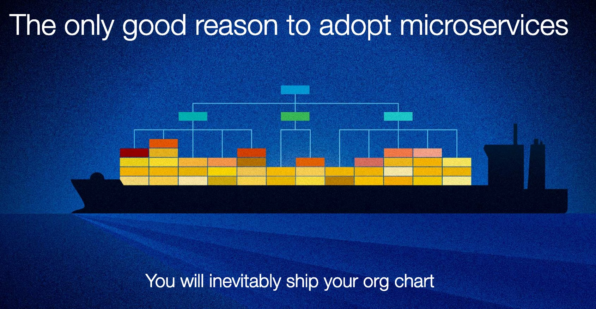

## Expertise vs Confidence

## Automation
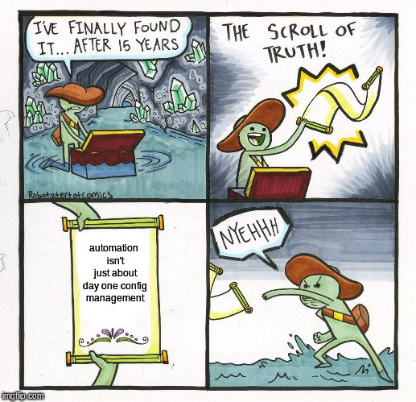

source: [Mierdin](https://twitter.com/Mierdin/status/1100535357165240320)

## Hype Con
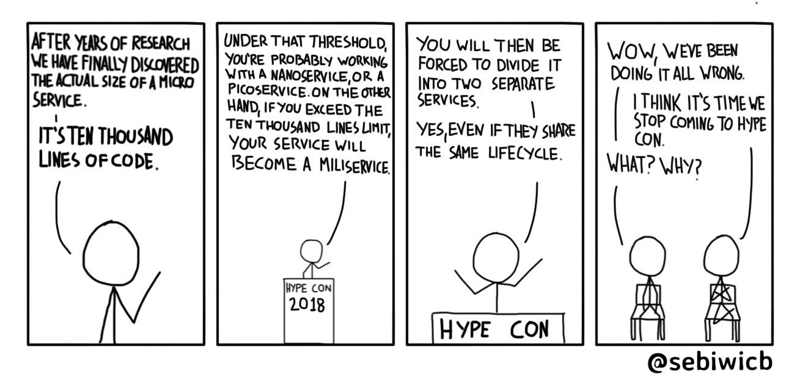

## How hard could it be?

## Technical Debt
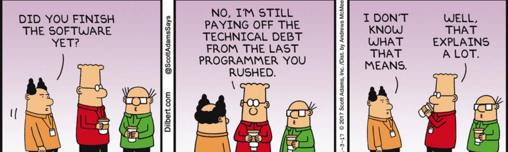
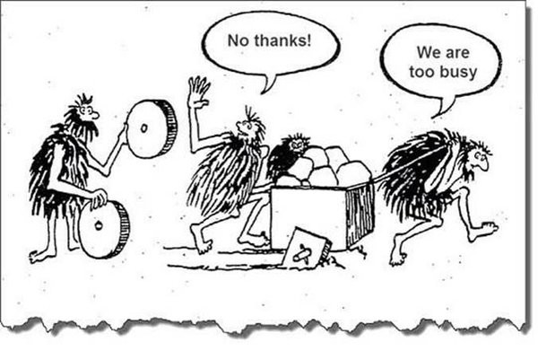

## DevOps culture

## Architecture
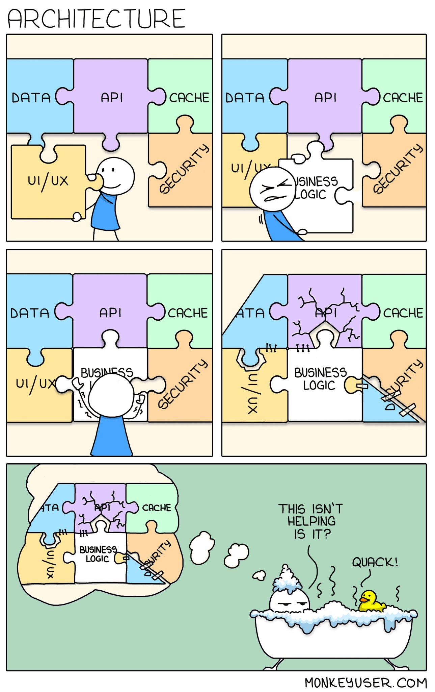

## Open-source these days
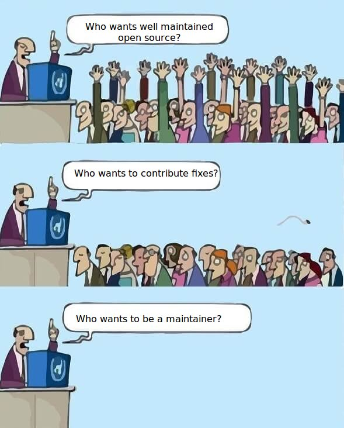

link: [@geowolf](https://twitter.com/geowolf/status/971811346823221248)

## One Talk to rule them all / Buzzwords
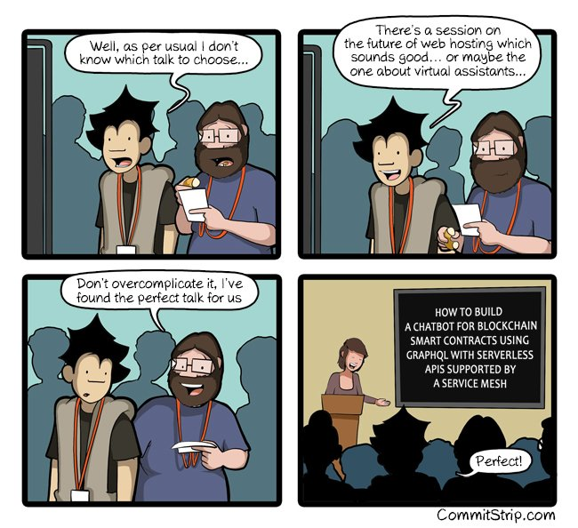

## Refactoring
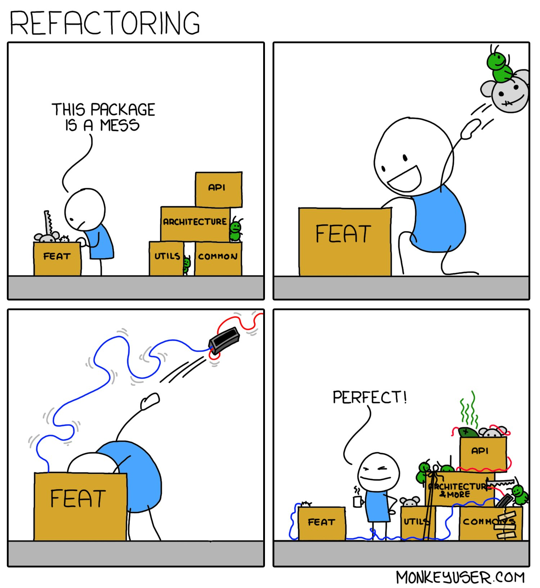

## DevOps & Security
by Pete Cheslock (@petecheslock)
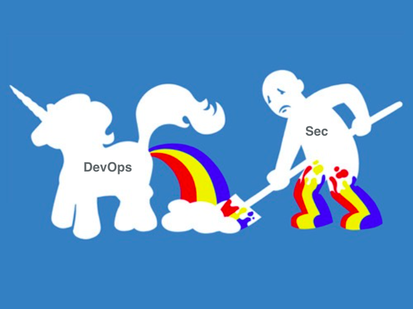

## Code reuse
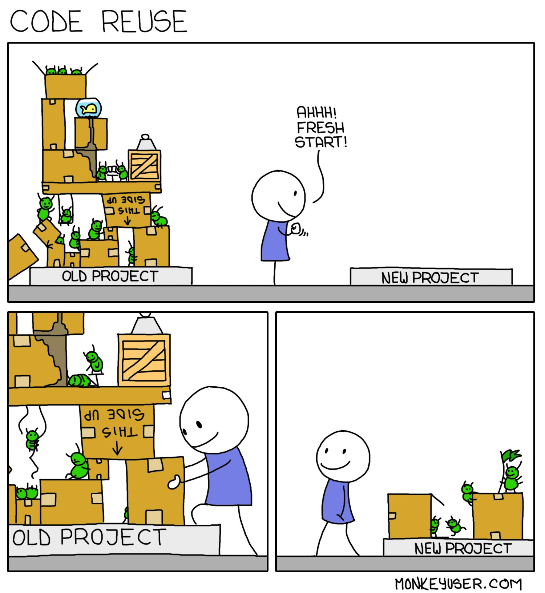

## A good architect leaves a footprint
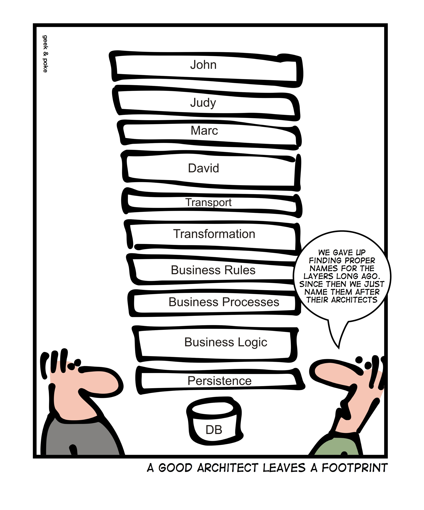
