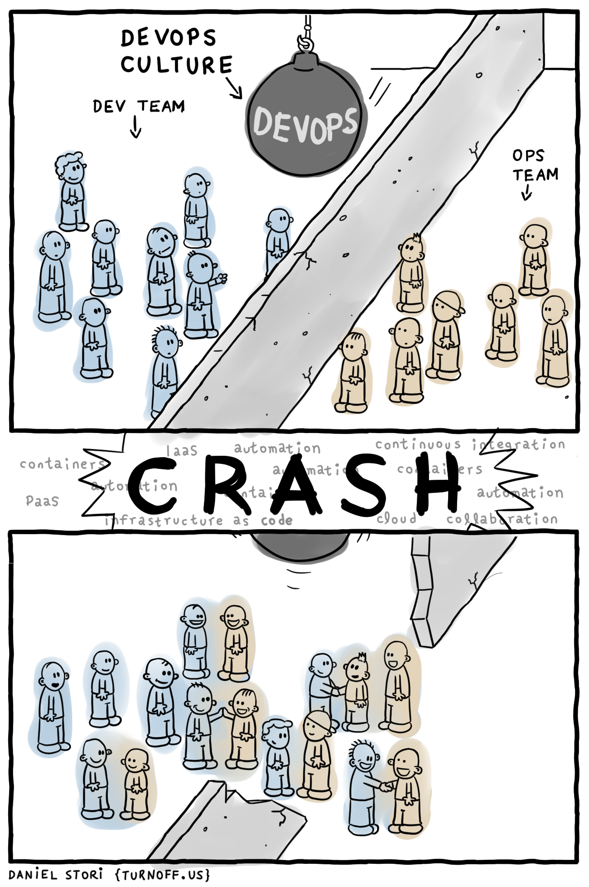

# CS_comics

## Technical Debt

## DevOps culture

## Architecture

## Open-source these days

link: [@geowolf](https://twitter.com/geowolf/status/971811346823221248)

## One Talk to rule them all / Buzzwords

## Refactoring

## DevOps & Security
by Pete Cheslock (@petecheslock)

## Code reuse

## A good architect leaves a footprint

